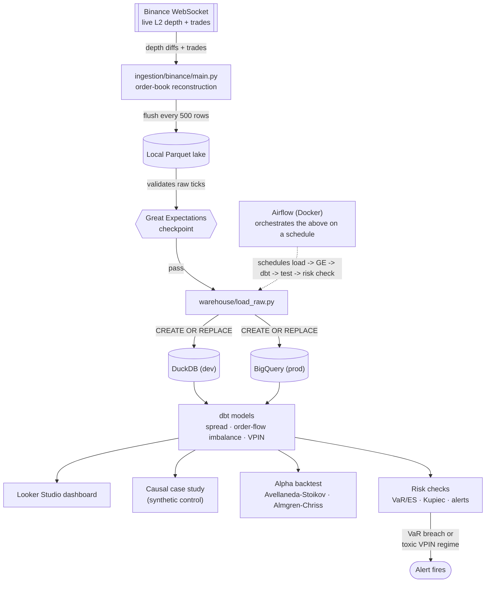

# Market Microstructure & Optimal Execution

[](https://github.com/kartik1pandey/market-microstructure/actions/workflows/tests.yml)

Live limit-order-book data captured from Binance, turned into genuine microstructure
signals, feeding two closed-form quant-finance models end to end — not a downloaded CSV,
not a toy simulation.


## One pipeline, four lenses

Raw ticks (Binance WebSocket) → local Parquet lake → dbt (feature transforms) →
BigQuery (warehouse) → four lenses:

| Lens | What it does | Targets |
|---|---|---|
| BIE | Liquidity/health dashboard — spread, depth, VPIN over time | BI/analytics engineer roles |
| DS-analytics | Event study: did ending a fee promotion shift BTC/TUSD liquidity? Synthetic control + placebo test | Data science roles |
| Alpha (quant researcher) | Avellaneda-Stoikov market-making + Almgren-Chriss execution, calibrated and backtested against real captured data | Quant research roles |
| Risk (quant analyst) | Rolling VaR/ES + Kupiec backtest, VPIN-based P&L attribution, alerting wired into Airflow | Quant risk roles |

## Status

All 7 build phases complete, 63 passing tests, CI green on every push. Ingestion captured a
multi-hour BTC/USDT session (spanning real price movement, not just a quiet flat window),
loaded into BigQuery, and then **deliberately paused** — the dashboard below is a stable
snapshot of that captured session rather than a live feed, so it looks the same to anyone
opening it later rather than depending on an always-on cloud process (see "Why not
continuous cloud ingestion?" below).

**Dashboard:** [Market Microstructure — Liquidity & Health (Looker Studio)](https://datastudio.google.com/reporting/05ccadec-b4e3-44b4-ae57-c69aac22b663)

## Architecture



### Why not continuous cloud ingestion?

A cloud deployment (Render) was built and tested: a worker streaming ticks straight into
BigQuery, and a cron job running the transform/risk pipeline every 15 minutes. It worked —
until checking actual Render pricing showed Background Workers and Cron Jobs aren't part of
the free tier, only web services with spin-down are. Running a 24/7 worker plus a scheduled
job indefinitely isn't worth the ongoing cost for a portfolio project, so the cloud path was
dropped in favor of a **captured-and-paused** snapshot: ingest a real, multi-hour session
once, load it into BigQuery, and stop. The dashboard reads a stable dataset either way — it
doesn't know or care whether the underlying pipeline is still running. The code for the
cloud path (`ingestion/binance/bigquery_writer.py`) is still in the repo and still tested,
since it's genuine, working infrastructure - just not deployed, for a cost reason stated
honestly rather than silently abandoned.

## What's actually in here

- **Ingestion** (`ingestion/binance/`): async WebSocket client reconstructing the live order
  book from Binance's diff-depth stream, with sequence-gap detection and reconnect-with-backoff.
- **Lake → warehouse** (`warehouse/`): local Parquet lake, loaded into DuckDB (dev) or
  BigQuery (prod) — same dbt models run against either target unchanged.
- **Transform** (`dbt/`): spread, depth, order-flow imbalance, and VPIN (real Bulk Volume
  Classification via a hand-implemented normal-CDF SQL macro — not a shortcut using the
  exchange's trade-side flag).
- **Data quality** (`data_quality/`): Great Expectations checkpoint, verified to actually
  catch injected bad data, not just pass on good data.
- **Orchestration** (`dags/`): Airflow (Docker), two lanes (dev/DuckDB, prod/BigQuery) off a
  shared data-quality gate, plus a risk-check task.
- **Causal case study** (`ds_analytics/`): pre-registered synthetic-control event study on a
  real, dated Binance fee-policy change — reports both the pre-registered (null) result and
  a clearly-labeled exploratory follow-up, not just whichever looked better.
- **Alpha** (`alpha/`): Avellaneda-Stoikov and Almgren-Chriss, calibrated from captured tick
  data (not textbook constants), backtested walk-forward against a naive baseline.
- **Risk** (`risk/`): rolling VaR/ES, Kupiec proportion-of-failures test, VPIN-based P&L
  attribution, and alerting rules wired into the live Airflow DAG.

## Screenshots

<!-- Screenshots added below - see screenshots/ -->

## Running it

```
python -m venv .venv && .venv\Scripts\activate   # Windows
pip install -r requirements.txt

# Ingest live ticks (Ctrl+C to stop, flushes cleanly)
python -m ingestion.binance.main BTCUSDT

# Load the lake into a warehouse and run the transforms
python -m warehouse.load_raw --target dev        # dev only - prod needs --confirm-prod-overwrite
cd dbt && dbt run --profiles-dir . --target dev

# Reproduce the causal case study / backtest / risk check
python -m ds_analytics.run_analysis --interval 1h
python -m alpha.run_backtest
python -m risk.run_risk_checks

# Tests
python -m pytest tests/ -v

# Full local orchestration (Airflow, Docker Desktop required)
docker compose up -d   # then open http://localhost:8080
```

## Grounding literature

- Avellaneda & Stoikov (2008), *High-frequency trading in a limit order book*
- Almgren & Chriss (2000), *Optimal execution of portfolio transactions*
- Cont, Kukanov & Stoikov (2014), *The Price Impact of Order Book Events*
- Easley, López de Prado & O'Hara (2012), *Flow Toxicity and Liquidity in a High-Frequency World*

## License

MIT — see [LICENSE](LICENSE).
