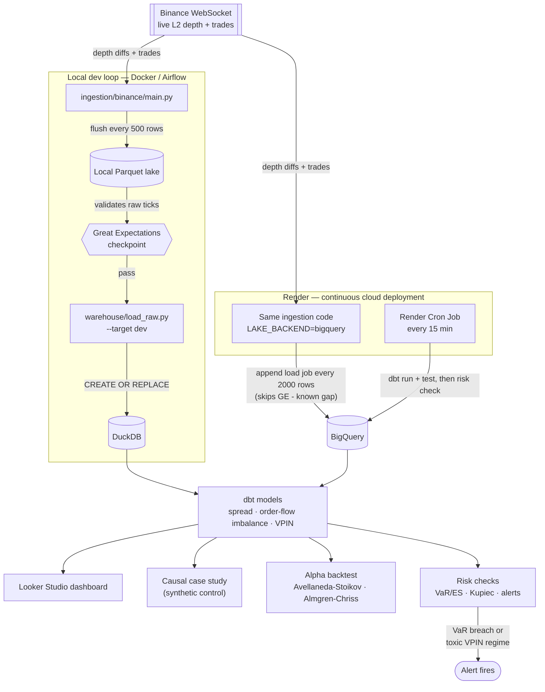

# Market Microstructure & Optimal Execution

[](https://github.com/kartik1pandey/market-microstructure/actions/workflows/tests.yml)

Live limit-order-book data captured from Binance, turned into genuine microstructure
signals, feeding two closed-form quant-finance models end to end — not a downloaded CSV,
not a toy simulation.


## One pipeline, four lenses

Raw ticks (Binance WebSocket) → Parquet lake / direct BigQuery stream → dbt (feature
transforms) → BigQuery (warehouse) → four lenses:

| Lens | What it does | Targets |
|---|---|---|
| BIE | Liquidity/health dashboard — spread, depth, VPIN over time | BI/analytics engineer roles |
| DS-analytics | Event study: did ending a fee promotion shift BTC/TUSD liquidity? Synthetic control + placebo test | Data science roles |
| Alpha (quant researcher) | Avellaneda-Stoikov market-making + Almgren-Chriss execution, calibrated and backtested against real captured data | Quant research roles |
| Risk (quant analyst) | Rolling VaR/ES + Kupiec backtest, VPIN-based P&L attribution, alerting wired into Airflow | Quant risk roles |

## Status

All 7 build phases complete. 63 passing tests, CI green on every push. Live dashboard,
live orchestration (Airflow locally, Render in the cloud), live BigQuery warehouse fed by
a continuous ingestion worker.

**Dashboard:** [Market Microstructure — Liquidity & Health (Looker Studio)](https://datastudio.google.com/reporting/05ccadec-b4e3-44b4-ae57-c69aac22b663)

## Architecture

Two ingestion paths feed the same warehouse: a local dev loop (Docker/Airflow-orchestrated,
Great-Expectations-gated) and a continuous cloud deployment on Render that streams straight
into BigQuery. Both converge at dbt, which feeds all four lenses identically regardless of
which path the data came from.



One honest gap, stated rather than hidden: the Great Expectations checkpoint currently only
validates the local Parquet lake, not BigQuery directly — the cloud deployment's streamed
data isn't run through that gate yet.

## What's actually in here

- **Ingestion** (`ingestion/binance/`): async WebSocket client reconstructing the live order
  book from Binance's diff-depth stream, with sequence-gap detection and reconnect-with-backoff.
  Two writer backends behind the same interface: local Parquet (`writer.py`, for local dev)
  and direct-to-BigQuery append load jobs (`bigquery_writer.py`, for continuous cloud
  deployment — built after discovering live that BigQuery Sandbox mode rejects streaming
  inserts outright).
- **Lake → warehouse** (`warehouse/`): local Parquet lake, loaded into DuckDB (dev) or
  BigQuery (prod) — same dbt models run against either target unchanged.
- **Transform** (`dbt/`): spread, depth, order-flow imbalance, and VPIN (real Bulk Volume
  Classification via a hand-implemented normal-CDF SQL macro — not a shortcut using the
  exchange's trade-side flag).
- **Data quality** (`data_quality/`): Great Expectations checkpoint, verified to actually
  catch injected bad data, not just pass on good data.
- **Orchestration**: Airflow (Docker, `dags/`) locally; a Render Blueprint (`render.yaml`)
  for continuous cloud deployment — a background worker for ingestion, a cron job for the
  transform/risk pipeline.
- **Causal case study** (`ds_analytics/`): pre-registered synthetic-control event study on a
  real, dated Binance fee-policy change — reports both the pre-registered (null) result and
  a clearly-labeled exploratory follow-up, not just whichever looked better.
- **Alpha** (`alpha/`): Avellaneda-Stoikov and Almgren-Chriss, calibrated from captured tick
  data (not textbook constants), backtested walk-forward against a naive baseline.
- **Risk** (`risk/`): rolling VaR/ES, Kupiec proportion-of-failures test, VPIN-based P&L
  attribution, and alerting rules wired into the live Airflow DAG.

## Running it

```
python -m venv .venv && .venv\Scripts\activate   # Windows
pip install -r requirements.txt

# Ingest live ticks (Ctrl+C to stop, flushes cleanly)
python -m ingestion.binance.main BTCUSDT

# Load the lake into a warehouse and run the transforms
python -m warehouse.load_raw --target dev        # dev only - prod needs --confirm-prod-overwrite
cd dbt && dbt run --profiles-dir . --target dev

# Reproduce the causal case study / backtest / risk check
python -m ds_analytics.run_analysis --interval 1h
python -m alpha.run_backtest
python -m risk.run_risk_checks

# Tests
python -m pytest tests/ -v

# Full local orchestration (Airflow, Docker Desktop required)
docker compose up -d
```

### Deploying continuously (Render)

`render.yaml` defines two services: a background worker running ingestion with
`LAKE_BACKEND=bigquery` (streams straight into BigQuery, no local disk dependency — Render's
free-tier filesystem is ephemeral), and a cron job running the dbt + risk pipeline every 15
minutes. Deploy via the [Render Blueprint](https://dashboard.render.com/blueprint/new?repo=https://github.com/kartik1pandey/market-microstructure),
filling in `GCP_SERVICE_ACCOUNT_JSON_B64` (your service account key, base64-encoded) as a
secret for both services.

## Grounding literature

- Avellaneda & Stoikov (2008), *High-frequency trading in a limit order book*
- Almgren & Chriss (2000), *Optimal execution of portfolio transactions*
- Cont, Kukanov & Stoikov (2014), *The Price Impact of Order Book Events*
- Easley, López de Prado & O'Hara (2012), *Flow Toxicity and Liquidity in a High-Frequency World*

## License

MIT — see [LICENSE](LICENSE).
